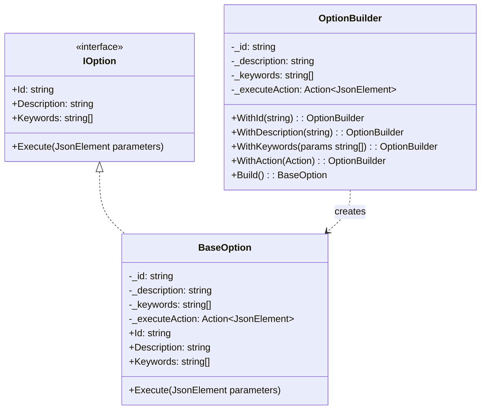

## CACHE METADATA
- ID: 3
- Created: 2026-03-27T13:05:33.751Z
- Git Commit: d92706c02b734ea59302fbbb61f7f525cbc6967d
- TTL: 168 hours

## QUERY
Where is baseOption defined? What is the structure of the keyword list in baseOption?

## SCHEMA
```json
{"type": "object", "properties": {"files": {"type": "array", "items": {"type": "object", "properties": {"path": {"type": "string"}, "description": {"type": "string"}}}}}}
```

## RESULT
## 调查结果

### 1. baseOption 定义位置

**文件路径**: `scripts/MultimodalFramework/BaseOption.cs`

`BaseOption` 是一个实现 `IOption` 接口的类，位于 `MultimodalFramework` 命名空间中。

### 2. Keyword List 结构

```csharp
private readonly string[] _keywords;
public string[] Keywords => _keywords;
```

**结构特点**:
- **类型**: `string[]` 字符串数组
- **存储**: 私有只读字段 `_keywords`
- **访问**: 通过 `Keywords` 属性公开只读访问
- **空值处理**: 构造函数中 `keywords ?? Array.Empty<string>()` 确保永不为 null

### 3. 相关代码结构



### 4. 使用示例

通过 `OptionBuilder` 创建带关键词的选项：

```csharp
var option = new OptionBuilder()
    .WithId("move_forward")
    .WithDescription("向前移动")
    .WithKeywords("前进", "向前", "走", "移动")  // keyword list
    .WithAction(() => { /* 执行逻辑 */ })
    .Build();
```

### 相关文件

| 文件 | 作用 |
|------|------|
| `scripts/MultimodalFramework/IOption.cs` | 定义 IOption 接口，声明 Keywords 属性 |
| `scripts/MultimodalFramework/BaseOption.cs` | BaseOption 实现类和 OptionBuilder 构建器 |
